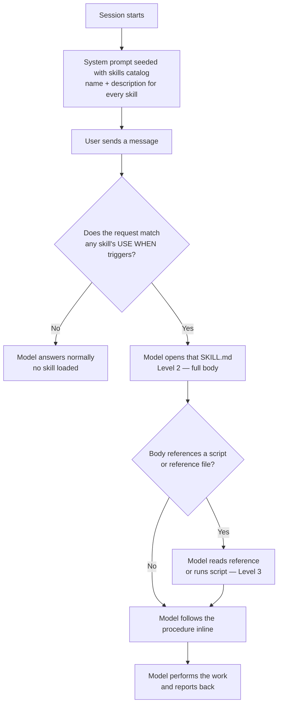

# How Skills Work in AI Models — A Deep Dive

A detailed, practical explanation of what "skills" are, how an AI model
discovers and uses them, and how to author good ones. Grounded in this repo's
`.github/skills/` setup, but the mechanics generalize to any agentic AI system.

> Quick version for this repo: see [.github/skills/HOW-SKILLS-WORK.md](../.github/skills/HOW-SKILLS-WORK.md).
> This document goes deeper into the *why* and the *model-side mechanics*.

## Table of contents

- [1. What a skill actually is](#1-what-a-skill-actually-is)
- [2. The core problem skills solve](#2-the-core-problem-skills-solve)
- [3. Progressive disclosure: the three levels](#3-progressive-disclosure-the-three-levels)
- [4. The skill lifecycle, step by step](#4-the-skill-lifecycle-step-by-step)
- [5. Anatomy of a SKILL.md](#5-anatomy-of-a-skillmd)
- [6. How the model decides to use a skill](#6-how-the-model-decides-to-use-a-skill)
- [7. Resources: scripts and references](#7-resources-scripts-and-references)
- [8. Skills vs. instructions vs. tools vs. hooks vs. MCP](#8-skills-vs-instructions-vs-tools-vs-hooks-vs-mcp)
- [9. Why this design works (the economics)](#9-why-this-design-works-the-economics)
- [10. Authoring guide and checklist](#10-authoring-guide-and-checklist)
- [11. Worked examples from this repo](#11-worked-examples-from-this-repo)
- [12. Failure modes and how to debug them](#12-failure-modes-and-how-to-debug-them)
- [13. Mental model summary](#13-mental-model-summary)

---

## 1. What a skill actually is

A **skill** is a folder of instructions plus optional helper files that teaches
an AI model how to perform a specific kind of task in a workspace. The model
reads it the same way it reads any other file — there is no magic runtime, no
plugin API. A skill is **just structured prose (and sometimes scripts) that the
model chooses to load when relevant.**

In this repo:

```
.github/
└── skills/
    ├── HOW-SKILLS-WORK.md            # meta-doc (not a skill itself)
    ├── axiomic-dev/
    │   ├── SKILL.md                  # the skill definition
    │   ├── references/architecture.md
    │   └── scripts/rebuild-wasm.sh
    ├── feature-docs/
    │   ├── SKILL.md
    │   └── assets/{feature-template.md, index-template.md}
    ├── feature-tests/
    │   ├── SKILL.md
    │   └── assets/testing-conventions.md
    └── session-keeper/
        ├── SKILL.md
        └── scripts/keep-session.mjs
```

The single required file is `SKILL.md`. Everything else (`scripts/`,
`references/`, `assets/`) is **payload** that `SKILL.md` points to.

A useful one-sentence definition:

> A skill is a named, on-demand playbook — selected by the model based on a
> short description — that turns a fuzzy capability ("document what we built")
> into a concrete, repeatable procedure (and optional tooling).

---

## 2. The core problem skills solve

A model's context window is finite and expensive. You cannot put every possible
procedure, convention, and helper script into the system prompt — it would:

- **Cost too much** (tokens are paid for on every request).
- **Dilute attention** (more irrelevant text = worse focus on the task).
- **Go stale** (huge prompts are hard to keep correct).

But you also cannot rely on the model to *re-derive* a fragile multi-step
process every time (e.g. "rebuild the WASM bundle with exactly these flags").
That produces inconsistent, error-prone results.

Skills resolve this tension with **lazy loading**: keep only a tiny "index card"
always in context, and fetch the full, version-controlled procedure **only when
the task calls for it**.

---

## 3. Progressive disclosure: the three levels

The model never holds full skill content all the time. Content loads in three
tiers, each only as far as needed:

| Level | What the model sees | When it loads | Token cost |
| --- | --- | --- | --- |
| **1 — Metadata** | `name` + `description` from each `SKILL.md` front-matter | Always (injected into the system prompt) | Tiny (a few lines per skill) |
| **2 — Body** | The full `SKILL.md` markdown | Only after the model decides the skill is relevant and opens the file | Medium (one skill's playbook) |
| **3 — Resources** | `scripts/*`, `references/*`, `assets/*` | Only when the body tells the model to read or run them | Variable (paid only on use) |

The key property: **you pay for detail only when you use it.** A workspace can
have dozens of skills while the always-on cost stays small, because Level 1 is
just short descriptions.

```
Always loaded (Level 1):        ~5–10 lines per skill (name + description)
Loaded on match (Level 2):      one SKILL.md body
Loaded on demand (Level 3):     specific scripts/references the body names
```

---

## 4. The skill lifecycle, step by step



1. **Session start.** The runtime builds a **skills catalog** from every
   `SKILL.md` front-matter and injects it into the system prompt. The model now
   permanently knows each skill's *name*, *when to use it*, and *file path*.
2. **User message.** The user asks for something.
3. **Matching.** The model compares the request against each skill's
   `description`, weighting the explicit `USE WHEN:` triggers heavily.
4. **Open (Level 2).** On a match, the model reads that `SKILL.md` with its
   normal file-reading tool.
5. **Resources (Level 3).** If the body says "run `keep-session.mjs`" or "see
   `references/architecture.md`", the model fetches those on demand.
6. **Execute & report.** The model follows the playbook and tells the user what
   it did.

Nothing here is special-cased in the model weights — it's the ordinary
"read a file, follow instructions, call a tool" loop, scoped by a good
description.

---

## 5. Anatomy of a SKILL.md

```markdown
---
name: feature-tests                                  # stable id (matches folder)
description: 'Keep tests in sync … USE WHEN: a prompt
  adds a feature …; a prompt fixes a bug …'          # the routing/trigger text
argument-hint: 'e.g. "add tests for what we built"'  # example invocations
---

# Feature Tests                                       # ← body starts (Level 2)

…explanation, file layout, the procedure to follow,
links to scripts/assets the model should use…
```

**Front-matter (the index card — always in context):**

- `name` — stable identifier, conventionally the folder name.
- `description` — *the single most important field.* It is the only thing
  (besides the name) that decides whether the skill is ever opened. Pack it with
  explicit **`USE WHEN:`** triggers phrased like real user requests.
- `argument-hint` — example invocations; helps both humans and the model
  recognize the shape of a matching request.

**Body (the playbook — loaded on match):**

- Concrete, actionable steps. Prefer numbered procedures over essays.
- Tables of where things live and how to run them.
- **Relative links** to siblings: `./assets/…`, `./scripts/…`, `../../docs/…`.
- The *current* correct behavior — rewrite stale sections rather than appending
  contradictions.

---

## 6. How the model decides to use a skill

The `description` is the **matching surface**. The model performs a semantic
comparison between the user's intent and each skill's description, with the
`USE WHEN:` clauses acting as high-signal triggers.

Good trigger phrasing mirrors how users actually ask:

```text
USE WHEN: a prompt adds a new feature, capability, command, endpoint,
component, or crate; a prompt fixes a bug or changes existing behavior;
the user asks to add/update tests or document how to run them.
```

Because those phrases overlap with real requests ("add tests for this",
"document what we just did", "I fixed the parser"), the right skill gets
selected without the user naming it.

Design implications:

- **Be specific and exhaustive in triggers.** Vague descriptions ("helps with
  testing") match poorly. Enumerate the situations.
- **Disambiguate overlapping skills.** If two skills could match, make each
  description state what it is *and is not* for, so the model picks correctly.
- **Pair skills explicitly.** If two should run together (e.g. `feature-docs`
  and `feature-tests`), say so in each body so one reliably pulls in the other.

---

## 7. Resources: scripts and references

The body links deeper files; the model only touches them on demand (Level 3).

- **`scripts/`** — runnable, version-controlled logic the model executes via the
  terminal instead of re-deriving it. Example:
  [session-keeper/scripts/keep-session.mjs](../.github/skills/session-keeper/scripts/keep-session.mjs)
  captures session logs;
  [axiomic-dev/scripts/rebuild-wasm.sh](../.github/skills/axiomic-dev/scripts/rebuild-wasm.sh)
  rebuilds WASM with the exact flags.
- **`references/`** — long background docs pulled in only when relevant (e.g.
  architecture notes), so they don't bloat the always-on context.
- **`assets/`** — templates and convention snippets to copy from, e.g.
  [feature-docs/assets/feature-template.md](../.github/skills/feature-docs/assets/feature-template.md)
  and
  [feature-tests/assets/testing-conventions.md](../.github/skills/feature-tests/assets/testing-conventions.md).

Why split logic into scripts? A bundled script is a **tested, deterministic
routine**. Having the model run it beats having the model regenerate fragile
code inline every time — fewer mistakes, reproducible results.

---

## 8. Skills vs. instructions vs. tools vs. hooks vs. MCP

These are different mechanisms that are easy to conflate:

| Mechanism | What it is | Who triggers it | Loaded/run when |
| --- | --- | --- | --- |
| **Skill** | An on-demand playbook folder (`SKILL.md` + payload) | The **model**, by matching the request to a description | When relevant to the user's intent |
| **Instructions** (`*.instructions.md`, `copilot-instructions.md`, `AGENTS.md`) | Always-on rules/preferences | Always applied (optionally scoped by `applyTo` globs) | Every turn (within scope) |
| **Tool** | A callable function the model can invoke (read file, run terminal, search) | The **model**, by emitting a tool call | Whenever the model needs the capability |
| **Hook** | A command wired to an event (e.g. end-of-turn `Stop`) | The **runtime**, automatically on the event | Deterministically, model not in the loop |
| **MCP server** | An external process exposing extra tools/resources | The model (via its tools) once configured | When its tools are called |

Key contrasts:

- **Skill vs. instructions:** instructions are *always on* (good for global
  conventions); skills are *lazy* (good for occasional, heavy procedures).
- **Skill vs. tool:** a tool is a *capability* (an action the model can take); a
  skill is *knowledge about when and how* to use capabilities for a task.
- **Skill vs. hook:** a skill is **model-invoked** and contextual; a hook is
  **event-invoked** and unconditional. They pair well — the `session-keeper`
  *skill* lets you configure/run capture conversationally, while a
  `session-keeper` *hook* runs the same capture automatically at turn end.

When you need a *guaranteed* action every time, use a hook. When you need
*contextual judgement* ("write appropriate tests for whatever changed"), use a
skill — a fixed command can't author context-specific work.

---

## 9. Why this design works (the economics)

- **Cheap context.** Only short descriptions are always loaded; full detail is
  fetched on demand. You can scale to many skills without ballooning the prompt.
- **Reliable behavior.** Procedures and scripts are version-controlled and
  reused verbatim instead of being re-improvised, so results are consistent.
- **Separation of concerns.** Triggering (description) is decoupled from
  execution (body) which is decoupled from logic (scripts). Each can change
  independently.
- **Discoverable and shareable.** Dropping a folder under `.github/skills/` with
  a good `description` is all it takes to teach the model a new capability for
  the workspace — and it travels with the repo for the whole team.
- **Auditable.** Because skills are plain files in version control, you can
  review, diff, and test them like any other code.

---

## 10. Authoring guide and checklist

**Where:** `.github/skills/<name>/SKILL.md` (folder name == `name`).

**Writing the front-matter:**

- [ ] `name` is stable and matches the folder.
- [ ] `description` leads with what it does, then a rich **`USE WHEN:`** list of
      real-request phrasings. This is what gets the skill selected.
- [ ] If it overlaps another skill, state what it is **not** for.
- [ ] `argument-hint` shows 1–2 example invocations.

**Writing the body:**

- [ ] Open with a one-line purpose.
- [ ] Give a **numbered procedure**, not an essay.
- [ ] Include a "where things live / how to run" table.
- [ ] Link heavy detail into `references/` and runnable logic into `scripts/`,
      using **relative paths** from `SKILL.md`.
- [ ] Describe *current* behavior; rewrite stale sections.
- [ ] Use **real, verified commands** — reuse exactly what worked.
- [ ] If it should pair with another skill, say so explicitly.

**Validate:**

- [ ] Ask a representative question and confirm the model opens the skill.
- [ ] Confirm any bundled script runs cleanly from the documented command.
- [ ] If something must run *unconditionally on an event*, add a **hook** under
      `.github/hooks/` instead of (or alongside) the skill.

---

## 11. Worked examples from this repo

**`feature-docs` + `feature-tests` (a paired set).**
A prompt like *"I fixed the CSV parser"* matches both skills' `USE WHEN: … a
prompt fixes a bug …` triggers. The model:

1. Opens [feature-tests/SKILL.md](../.github/skills/feature-tests/SKILL.md),
   reads [assets/testing-conventions.md](../.github/skills/feature-tests/assets/testing-conventions.md),
   adds a regression test, runs the suite, and updates
   [docs/TESTING.md](./TESTING.md).
2. Opens [feature-docs/SKILL.md](../.github/skills/feature-docs/SKILL.md),
   updates the relevant page under [docs/features/](./features/), and prepends a
   changelog entry.

Each body names the other, so one reliably pulls in its partner before the turn
ends — keeping code, tests, and docs in lockstep.

**`session-keeper` (skill + hook).**
*"Save this session's commands and thinking"* matches the skill's triggers; the
model opens its `SKILL.md` and runs `keep-session.mjs`. Separately, a `Stop`
hook runs the **same** script automatically at every turn end — the skill is the
conversational front door, the hook is the always-on guarantee.

**`axiomic-dev` (procedure + script).**
*"Add an ATR indicator and rebuild the WASM"* matches its triggers; the body
sends the model to `scripts/rebuild-wasm.sh` so the bundle is rebuilt with the
exact, tested flags rather than improvised ones.

---

## 12. Failure modes and how to debug them

| Symptom | Likely cause | Fix |
| --- | --- | --- |
| Skill never fires | `description` lacks the user's phrasing | Add concrete `USE WHEN:` triggers that mirror real requests |
| Wrong skill fires | Two descriptions overlap | Add "is / is not for" disambiguation to each |
| Skill loads but skips a script | Body doesn't clearly instruct to run it | Make the step explicit: "Run `./scripts/x.sh`" |
| Broken resource link | Absolute or wrong relative path | Use paths relative to `SKILL.md` |
| Stale/contradictory guidance | Sections appended over time | Rewrite to describe current behavior only |
| Needs to run every time but doesn't | Relying on model judgement for a guaranteed action | Add a **hook**, not (only) a skill |

To investigate *why* a skill did or didn't load in a real session, inspect the
Copilot debug logs (see the `troubleshoot` skill / the session debug-log JSONL).

---

## 13. Mental model summary

- A skill is **prose + payload the model loads on demand** — not a runtime
  plugin.
- The system prompt always carries a **catalog of index cards** (name +
  description); full bodies and resources load only when matched/needed
  (**progressive disclosure**).
- The **`description` (especially `USE WHEN:`) is the routing layer** — it
  decides selection. Write it like the questions users actually ask.
- The **body is the playbook**; **scripts/references/assets** are deterministic,
  version-controlled payload it pulls in.
- Use **instructions** for always-on rules, **tools** for capabilities,
  **hooks** for unconditional event actions, and **skills** for contextual,
  occasional, heavy procedures — and pair them when a task needs more than one.

---

### See also

- Repo quick reference: [.github/skills/HOW-SKILLS-WORK.md](../.github/skills/HOW-SKILLS-WORK.md)
- Skills in this repo: [axiomic-dev](../.github/skills/axiomic-dev/SKILL.md),
  [feature-docs](../.github/skills/feature-docs/SKILL.md),
  [feature-tests](../.github/skills/feature-tests/SKILL.md),
  [session-keeper](../.github/skills/session-keeper/SKILL.md)
